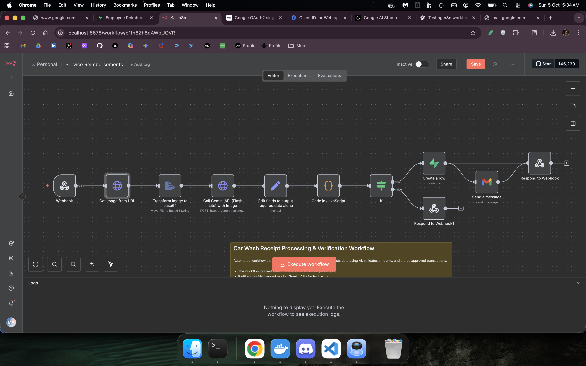

# Car Wash Receipt Automation

Automates receipt processing for car wash expenses. They needed this feature added to their mobile app workflow. Built an n8n workflow to handle the processing without changing their existing app.

## What It Does

An n8n workflow that processes receipt images automatically:

- Takes receipt photos and converts them to base64
- Uses Gemini API to extract transaction details
- Checks amounts against spending limits
- Saves approved receipts to Supabase
- Sends confirmation emails

## Stack

- n8n
- Gemini API
- Supabase
- Email

## Result

Reduced their receipt processing from manual entry to automatic. Saves time and keeps records organized.

## Workflow

---

*Custom project built upon requirements. Actual workflow not included.*
